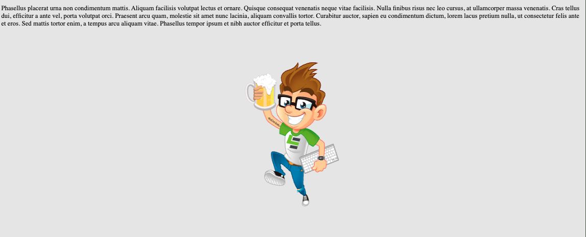

# edje-spinner
 
The concept is to have a series of spinners for Leading EDJE, built into one platform.




## Installation Notes

### Node Modules

```script
> npm install https://github.com/bob-fornal/edje-spinner
```

#### Angular Implementation

(coming soon)

#### React Implementation

(coming)

### Development

```script
> npm install
```

## Usage Notes

The images are optimized and converted to JavaScript for incorporation. Then the Minified code is generate.

This script generates a `/optimized` and `/build` set of SVG and JavaScript code, based on `/source` SVG images.

### Build Minified File

```script
> gulp
```

## Attributes

| Attribute | Description | Values (DEFAULT) |
|-----------|-------------|------------------|
| active | Is active? | true, (false) |
| debug | console.log | true, (false) |
| config | Configuration Options | undefined |

### Configuration Options
| Key | Description | Values (DEFAULT) |
|-----|-------------|------------------|
| display | Display Options | (normal), round |
| size | T-shirt Sizes | (normal) |
| type | Image Type | (eddie), le, \[external\] |
| | external | Also use path |
| path | Used with "external" | path to the file |

## Task List

- [x] Web Component (JavaScript ONLY)
- [x] Accept Attribute Changes
- [x] Images to SVG and Import
- [ ] Test and Angular Install
- [ ] Test and React Install
- [x] Installation Notes
- [x] Usage Notes
- [x] Build Process (Gulp, SVG Optimization, Conversion, and Build)

### Configuration

- [x] Display Options, Horizontal Spin or Round Spinner
- [x] Accept an external image
- [ ] T-shirt sizes
- [ ] Allow change of "round" border and background colors
- [ ] Allow change of background (whole screen)

## Reference

These are sites I've been using ...

* [PNG to SVG Converted](https://svgconverter.app/free)
* [SVG Sanitizer / Validation](https://svg.enshrined.co.uk/)
