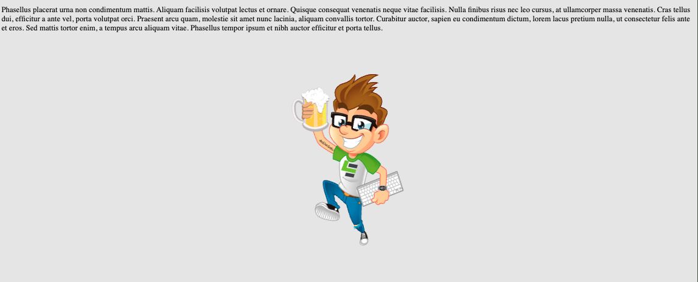

# edje-spinner
 
The concept is to have a series of spinners for Leading EDJE, built into one platform.




## Installation Notes

### Node Modules

To add the spinner to the `node_modules`, use the following command. If it is updated, this command will need re-run; `npm install` will not update this from the repository.

```script
npm install https://github.com/bob-fornal/edje-spinner
```

#### Angular Implementation

In the `angular.json` file, include the minified production script and CSS file.


Use the `[attr.---]` pattern to set the attributes for the `<edje-spinner>` Web Component.


Additionally, the `[attr.config]` need to be stringified.


> **REPOSITORY**: [Angular Repo](https://github.com/bob-fornal/edje-spinner-angular)

#### React Implementation

First, set up the code to move the CSS and Javascript files from `node_modules` into the `public` folder.


Import the CSS in the `_app.tsx` file.


Here you can see the JavaScript file loaded and the spinner component implemented in the `index.tsx` file.


... here are the state settings for the "active" variable.


Since this project uses TypeScript, the following needs added to ensure the linting doesn't complain.


> **REPOSITORY**: [React Repo](https://github.com/bob-fornal/edje-spinner-react)

### Development

```script
npm install
```

## Usage Notes

The images are optimized and converted to JavaScript for incorporation. Then the Minified code is generate.

This script generates a `/optimized` and `/build` set of SVG and JavaScript code, based on `/source` SVG images.

### Build Minified File

```script
gulp
```

## Attributes

| Attribute | Description | Values (DEFAULT) |
|-----------|-------------|------------------|
| active | Is active? | true, (false) |
| debug | console.log | true, (false) |
| config | Configuration Options | undefined |

### Configuration Options
| Key | Description | Values (DEFAULT) |
|-----|-------------|------------------|
| display | Display Options | (normal), round |
| size | T-shirt Sizes | extra-small, small, (medium), large, extra-large |
| styleBackground | style="" content for round border and background, use !important | background-color, border-right, border-bottom, border-left |
| styleContainer | style="" content for whole screen background, use !important | background-color |
| type | Image Type | (eddie), le, \[external\] |
| | external | Also use path |
| path | Used with "external" | path to the file |

## Task List

- [x] Web Component (JavaScript ONLY)
- [x] Accept Attribute Changes
- [x] Images to SVG and Import
- [x] Test Angular Install
- [x] Test React Install
- [ ] Test Vue Install
- [x] Installation Notes
- [x] Usage Notes
- [x] Build Process (Gulp, SVG Optimization, Conversion, and Build)
- [x] Externalize CSS for simpler design

### Configuration

- [x] Display Options, Horizontal Spin or Round Spinner
- [x] Accept an external image
- [x] T-shirt sizes
- [x] Allow change of "round" border and background colors
- [x] Allow change of background (whole screen)

## Reference

These are sites I've been using ...

* [PNG to SVG Converted](https://svgconverter.app/free)
* [SVG Sanitizer / Validation](https://svg.enshrined.co.uk/)
