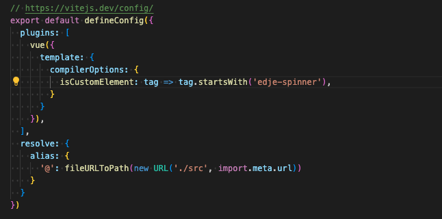

# &lt;edje-spinner&gt;
 
The concept is to have a series of spinners for Leading EDJE, built into one platform.


## Sections

* [Installation Notes](#installation-notes)
* [Angular Implementation](#angular-implementation)
* [React Implementation](#react-implementation)
* [Vue Implementation](#vue-implementation)
* [Usage Notes](#usage-notes)
* [Attributes](#attributes)
* [Task List](#task-list)
* [Reference](#reference)

## Installation Notes

[Back to Top](#sections)

### Node Modules

To add the spinner to the `/node_modules`, use the following command.

```script
npm install https://github.com/bob-fornal/edje-spinner
```

> If it is updated, this command will need re-run; `npm install` will not update this from the repository.

### Development Notes

This project is designed to run from the root of the repository.

```script
npm install
```

Once `npm install` is run, serve the index.html file to test the spinner.

If changes are made to the `/images/source` files, the `config.js`, `edje-spinner.css`, or the `edje-spinner.js` ... the project will need to be rebuilt. The `index.html` file uses the compiled version in the `/dist` folder.

### Build Minified File

```script
gulp
```

## Angular Implementation

[Back to Top](#sections)

In the `angular.json` file, include the minified production script and CSS file.


Use the `[attr.---]` pattern to set the attributes for the `<edje-spinner>` Web Component.


Additionally, the `[attr.config]` need to be stringified.


> **REPOSITORY**: [Angular Repo](https://github.com/bob-fornal/edje-spinner-angular)

## React Implementation

[Back to Top](#sections)

First, set up the code to move the CSS and Javascript files from `/node_modules` into the `/public` folder.


Import the CSS in the `_app.tsx` file.


Here you can see the JavaScript file loaded and the spinner component implemented in the `index.tsx` file.


... here are the state settings for the "active" variable.


Since this project uses TypeScript, the following needs added to ensure the linting doesn't complain.


> **REPOSITORY**: [React Repo](https://github.com/bob-fornal/edje-spinner-react)

## Vue Implementation

[Back to Top](#sections)

First, set up the code to move the CSS and Javascript files from `/node_modules` into the `/src/assets` folder.


Configure Vue to recognize the spinner tag as a Custom Element in the `vite.config.js` file.



Import the CSS and JavaScript in the `main.js` file.


Here is implementation code ...


> **REPOSITORY**: [Vue Repo](https://github.com/bob-fornal/edje-spinner-vue)

## Usage Notes

[Back to Top](#sections)

The images in `/source`are optimized and converted to JavaScript for incorporation. Then the Minified code is generate.

This script generates a `/optimized` and `/build` set of SVG and JavaScript code, based on `/source` SVG images.

## Attributes

[Back to Top](#sections)

| Attribute | Description | Values (DEFAULT) |
|-----------|-------------|------------------|
| active | Is active? | true, (false) |
| debug | console.log | true, (false) |
| config | Configuration Options | undefined |

### Configuration Options
| Key | Description | Values (DEFAULT) |
|-----|-------------|------------------|
| display | Display Options | (normal), round |
| size | T-shirt Sizes | extra-small, small, (medium), large, extra-large |
| styleBackground | style="" content for round border and background, use !important | background-color, border-right, border-bottom, border-left |
| styleContainer | style="" content for whole screen background, use !important | background-color |
| type | Image Type | (eddie), le, \[external\] |
| | external | Also use path |
| path | Used with "external" | path to the file |

## Task List

[Back to Top](#sections)

- [x] Web Component (JavaScript ONLY)
- [x] Accept Attribute Changes
- [x] Images to SVG and Import
- [x] Test Angular Install
- [x] Test React Install
- [x] Test Vue Install
- [x] Installation Notes
- [x] Usage Notes
- [x] Build Process (Gulp, SVG Optimization, Conversion, and Build)
- [x] Externalize CSS for simpler design
- [x] Built in Attribute Reflection

### Configuration

- [x] Display Options, Horizontal Spin or Round Spinner
- [x] Accept an external image
- [x] T-shirt sizes
- [x] Allow change of "round" border and background colors
- [x] Allow change of background (whole screen)

## Reference

[Back to Top](#sections)

These are sites I've been using ...

### Sites / Documentation

* [MDN: Web Components](https://developer.mozilla.org/en-US/docs/Web/API/Web_components)
* [MDN: Custom Elements](https://developer.mozilla.org/en-US/docs/Web/API/Web_components/Using_custom_elements)
* [CSS Tricks: Styling a Web Component](https://css-tricks.com/styling-a-web-component/)

### Go Make Things

* [Web Component Lifecycle](https://gomakethings.com/the-web-component-lifecycle-methods/)
* [Detect when Attributes Change on a Web Component](https://gomakethings.com/how-to-detect-when-attributes-change-on-a-web-component/)
* [More Ways to Instantiate Web Components](https://gomakethings.com/more-ways-to-instantiate-web-components/)

### Images

* [PNG to SVG Converted](https://svgconverter.app/free)
* [SVG Sanitizer / Validation](https://svg.enshrined.co.uk/)
